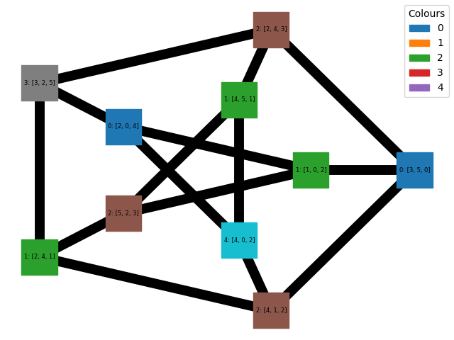
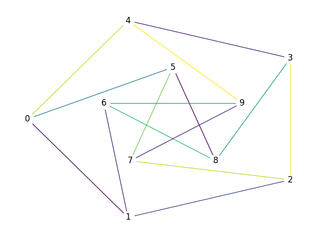
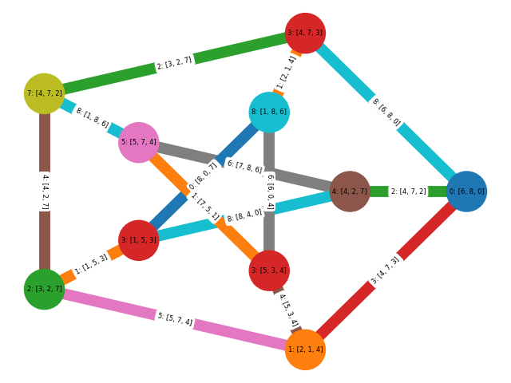
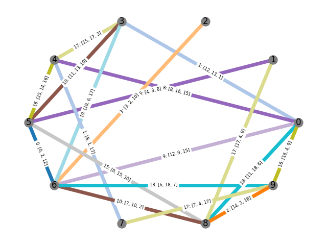

# greedy-list-colouring

Greedy list and greedy list-edge colouring in Python with the listcolouring package.

## Greedy list-node colouring of the Petersen graph

## Greedy list-edge colouring of the Petersen graph

## Greedy list-total colouring of the Petersen graph

## Greedy list-edge colouring of a random graph

